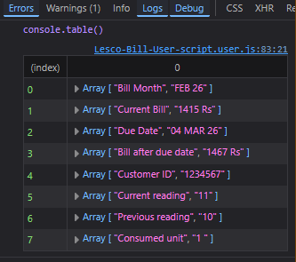
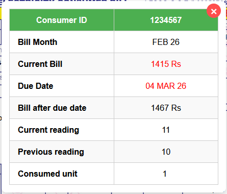
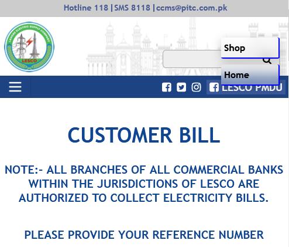
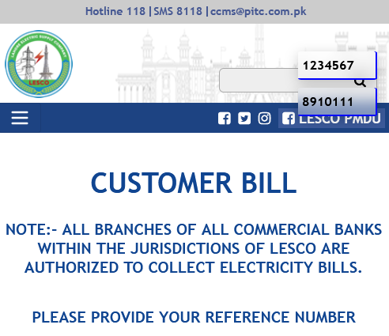

<h1 align="center">LESCO Bill Checker - Userscript</h1>

<p align="center">
  Automate checking your LESCO electricity bills with one click, track units, and forward data to server of your liking (optional). 
</p>

--- 

<p align="center">
  <a href="https://play.google.com/store/apps/details?id=org.mozilla.firefox"></a>
  <a href="https://apps.apple.com/qa/app/stay-for-safari/id1591620171/"></a>
  <a href="https://www.tampermonkey.net/"></a>
  <a href="https://www.tampermonkey.net/"></a>
</p>

<p align="center">
  <a href="https://github.com/ihtshamcodes/lescoBill">
    
  </a>
</p>

---
- [Use Cases](#use-cases)
- [Features](#features)
- [How Data is displayed](#how-data-is-displayed)
- [Installation](#installation)
- [Usage guide](#usage)
- [Supported Pages](#supported-pages)
- [Warnings & Notes](#warnings--notes)
- [Known bug](#known-bug)

---

## Use Cases 
* As you all guys knows, due to inflation you need to keep track of the units you used and ensure that they don't exceed past 200.
* To do so, you need to be aware of your current meter reading (for which you was billed this month) `minus` ongoing reading from your meter. 
* You can send this scraped data anywhere and keep the readings save for quick access (removes the need to store physical copy of your bill).

---

## Features

- Multi-Consumer ID support with [floating UI](#installation)
- Auto fills forms, bypasses Captcha prompt
- Extracts bill data:
  - Bill Month
  - Current Bill Amount
  - Due Date
  - Units Consumed
  - Current & Previous Meter Readings
- Webhook / Automation ready (n8n, Google Sheets, MacroDroid, ntfy.sh, custom API etc)
- Works on official [LESCO](https://www.lesco.gov.pk:36269/Modules/CustomerBillN/CheckBill.asp) pages only

---

## How data is displayed: 
```javascript
// Example: Extracted billInfo array
[
  ["Bill Month", "Feb 2026"],
  ["Current Bill", "1415"],
  ["Due Date", "04-03-2026"],
  ["Bill after due date", "1487"],
  ["Customer ID", "1234567"],
  ["Current reading", "11"],
  ["Previous reading", "10"],
  ["Consumed unit", "1"]
]

)
```

<center>
<table>
<tbody>
<tr>
<td></td>
<td></td>
</tr>
</tbody>
</table>
</center>

---

## Installation

1. Install a userscript manager:

   * [Tampermonkey](https://www.tampermonkey.net/) (works on Android too. Use [Firefox Android](https://play.google.com/store/apps/details?id=org.mozilla.firefox) and load this extension for this userscript to work)
   * [Violentmonkey](https://violentmonkey.github.io/)
   * [Stay](https://apps.apple.com/qa/app/stay-for-safari/id1591620171) (iOS)
2. Add the userscript from this repository.
    - copy paste `lesco.user.js`
    - or use this link to import `https://github.com/ihtshamcodes/lescoBill/lesco.user.js`
3. Set your Consumer IDs and IDsName in the script:

    ##### **If `IDsName` are filled:**

    ```js
    let IDsName = ["Home", "Shop"]; // Optional
    let yourIDs = [1234567, 8910111];
    ```

    <center></center>

    ##### **If `IDsName` are left empty:**
    ```js
    let IDsName = []; // Optional
    let yourIDs = [1234567, 8910111];
    ```


    <center></center>


---

## Usage

* Navigate to the LESCO Customer Menu page.
* Click the floating panel to select an ID.
* Data will auto-populate and logs `billInfo` to console.
* Forward to webhook (optional):

```javascript
fetch("https://your-webhook.com", {
  method: "POST",
  headers: { "Content-Type": "application/json" },
  body: JSON.stringify(billInfo)
});
```

---

## Supported Pages

* https://www.lesco.gov.pk:36269/Modules/CustomerBillN/CheckBill.asp
* https://www.lesco.gov.pk:36269/Modules/CustomerBillN/CustomerMenu.asp
* https://www.lesco.gov.pk:36260/Bill.aspx

---

## Warnings & Notes

> Intended for personal use only.
> Do not scrape or abuse LESCO systems.

> Can integrate with Google Sheets, n8n workflows, MacroDroid, ntfy.sh, or your own database using `billInfo` variable.

---

## Known bug

> The official LESCO website displays bill data in tables using various CSS positioning techniques (like absolute, relative, etc.), which makes extracting information challenging. I’ve done my best to capture the relevant data reliably. The script uses a truthy/falsy logic to identify and extract the necessary values.

---

<p align="center">
  Made with ❤️ by Dr Ihtsham
  <br><a hre='https://github.com/ihtshamcodes/'>GitHub</a>
</p>

---
